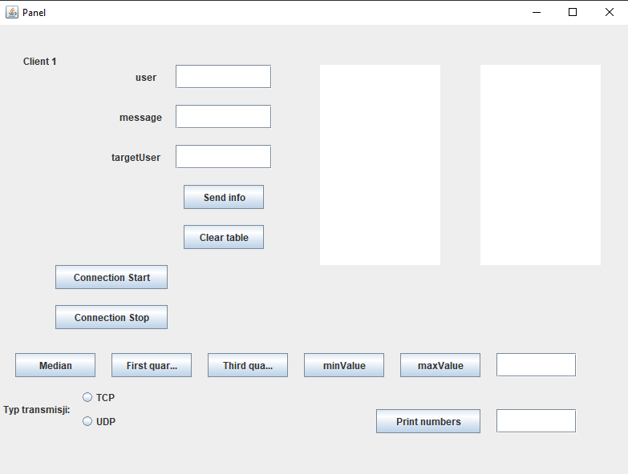
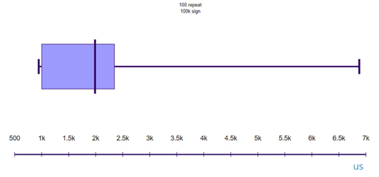
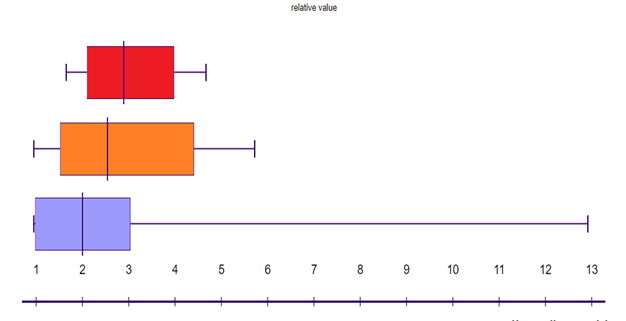
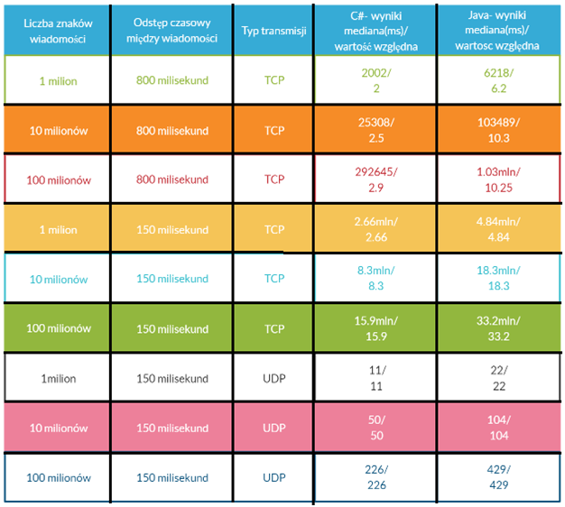

# Multi-threaded-messenger-in-Java

The main goal of the project was to test the efficiency of text data flow. The program assumed the creation of a multi-threaded server that would handle queuing, saving and maintaining the current network connection between two users. The main client layout looks like this:

The study was divided into 3 categories:
- 1 million characters long message
- 10 million characters long message
- a message of 100 million characters

Three research attempts were made:
- sending a text message every 850 milliseconds using the TCP protocol
- sending a text message every 150 milliseconds using TCP protocol, checking queuing performance and data flow performance on the server side
- sending every 150 milliseconds using the UDP protocol, checking how many packets have been lost.

A total of 9 research trials were established.

The study was graphically simulated using Box and Whisker. The rectangle outlined in the graph is the data flow times (the most common information repetition density).

The fastest and the slowest data transmission times are also taken into account. An exemplary chart is as follows:

The flow time for relative value is shown below:

Finally, the results for the application in C # and Java look as follows, from the bottom(from the bottom for a million characters, middle 10 million, top 100 million):

